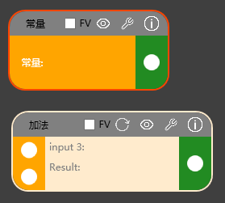

# Fantasy.Wpf.NodeEditControl
## 概述

Fantasy.Wpf.NodeEditControl 是一款基于**WPF框架**的node节点编辑器控件，基于.net7开发。
该控件具备**高扩展性**和**高定制化**的要求进行开发！

## 控件组成

该控件由**Node组件**，**Port组件**，**Line组件**和**Canvas**组成。

### Node(节点)
Node组件的默认样式如下：

节点具备基本的输入和输出以及节点本身的属性调节。默认情况下，左边的端口是输入，右边的端口是输出，点击输出端口并拖拽会出现一根连接线，如图所示：

节点具备一些属性，例如冷冻属性，查看结果，设置属性，查看信息，如图所示：

1. 冷冻属性

该属性是一个bool值，默认是false（即默认不冻结）,冷冻属性是指当前节点不进行计算（如果一次计算都没有过，那么会进行一次计算）。

当未勾选FV时候，当上游节点发生更改时候，会自动计算下游节点。

当勾选FV时候，被勾选的节点在上游节点更改的时候不会进行计算，包括被冻结的下游节点。

2. 重新计算

默认情况下当上游的节点发生更改的时候，会自动计算下游节点。若节点FV（冻结属性）的值由true变成false，需要手动点击**重新计算**节点进行更新节点

3. 查看结果

查看结果会打开一个窗口，该窗口用于展现节点最终的计算结果。如图所示:

查看结果会根据上游的更改自动更新结果窗口。

4. 设置属性

设置属性会打开该节点的属性面板，属性面板用于调节该节点的属性，当节点属性发生变化时候，会自动更新下游节点。

5. 查看节点说明

查看节点说明会打开节点说明面板，该面板会详细解释该节点的用法。

节点删除

默认删除节点的操作是鼠标右击节点，弹出菜单栏中选择‘删除’按钮。

### Port(端口)

端口必须依赖于节点。如图所示：

端口的作用仅限于连接两个节点。

### Line（线条）

线条用于连接两个节点，但并不是直接作用于节点，线条只作用于端口上。

删除线条

鼠标右键选择线条，会打开菜单，选择**断开**即可。

### Canvas(画板)

画板用于承载节点和线条，并提供用户操作。如图所示:

1. 创建节点
从树形图拖拽节点到画板上可创建节点

2. 拖拽画板
鼠标中键按住移动鼠标即可移动画板位置

3. 缩放画板
滚动鼠标中键即可缩放画板

4. 移动节点
选择要移动的节点，鼠标左键拖拽即可移动节点

## 使用方法

### 添加控件

~~~C#
<Window x:Class="WpfApp3.MainWindow"
        xmlns="http://schemas.microsoft.com/winfx/2006/xaml/presentation"
        xmlns:x="http://schemas.microsoft.com/winfx/2006/xaml"
        xmlns:d="http://schemas.microsoft.com/expression/blend/2008"
        xmlns:mc="http://schemas.openxmlformats.org/markup-compatibility/2006"
        xmlns:local="clr-namespace:WpfApp3"
        xmlns:controls="clr-namespace:Fantasy.Wpf.NodeEditControl.Controls;assembly=Fantasy.Wpf.NodeEditControl"
        xmlns:nodes="clr-namespace:Fantasy.Wpf.NodeEditControl.Controls.Nodes;assembly=Fantasy.Wpf.NodeEditControl"
        mc:Ignorable="d"
        Title="MainWindow" Height="450" Width="800">

    <controls:NodeInkCanvas x:Name="canvas"></controls:NodeInkCanvas>
</Window>
~~~

主要添加

~~~C#
 <controls:NodeInkCanvas x:Name="canvas"></controls:NodeInkCanvas>
~~~

### 注册节点

当添加控件后，是无法使用节点的，因为树形图上还没有挂在节点。
若要使用节点，还需要挂载节点。

~~~c#
this.canvas.RegistNode(typeof(AdditionNode), "加法");
this.canvas.RegistNode(typeof(ConstNode), "常量");
this.canvas.RegistNode(typeof(MultiplicationNode),");
~~~

### 配置样式

如果默认的样式不能满足需求，可以通过`FantasyNodeGlobalSetting`静态类进行配置。配置样式需要重写`FantasyNodeFactoryBase`类。

~~~c#
 public abstract class FantasyNodeFactoryBase
    {
        public virtual LineBase SetLineStyle() {
            return new ArrowLine();
        }

        public virtual NodeContainerBase SetNodeContainerStyle()
        {
            return new NodeContainer();
        }

        public virtual NodeInfoDialogBase SetNodeInfoDialogStyle()
        {
            return new DefaultNodeInfoDialog();
        }

        public virtual SettingDialogBase SetSettingDialogStyle()
        {
            return new DefaultNodeSettingDialog();
        }
    }
~~~
对需要重写的样式和配置，可覆盖上述的方法。

~~~c#
 public class MyStyle : FantasyNodeFactoryBase
    {
        public override LineBase SetLineStyle()
        {
            return new BezierLine();
        }
    }
~~~

调用
~~~c#
  FantasyNodeGlobalSetting.ConfigFantasy = new MyStyle();
~~~

## 自定义组件

### 自定义节点

自定义节点非常简单，只需要将节点类继承于`NodeBase`,需要重写以下方法：

~~~c#
        public override List<PortBase> GetPorts()
        {
            throw new NotImplementedException();
        }

        protected override OutputData CalculateImpl(object data)
        {
            throw new NotImplementedException();
        }

        protected override Size GetNodeSize()
        {
            throw new NotImplementedException();
        }

        protected override string GetNodeName()
        {
            throw new NotImplementedException();
        }

        public override string GetNodeSummary()
        {
            throw new NotImplementedException();
        }

        public override List<Type> SupportInputTypes()
        {
            throw new NotImplementedException();
        }

        public override List<Type> SupportOutputTypes()
        {
            throw new NotImplementedException();
        }

        public override NodeResultPanelBase SetNodeResultPanel()
        {
            throw new NotImplementedException();
        }

        public override SettingPanelBase SetSettingContent()
        {
            throw new NotImplementedException();
        }
~~~

#### 方法说明

`public override List<PortBase> GetPorts()`

  获得当前节点的所有端口，通常一个节点都会有若干的输入和输出的端口，该方法需要返回该节点的所有的端口。

  ~~~C#
<Grid Background="BlanchedAlmond">
        <Grid.ColumnDefinitions>
            <ColumnDefinition Width="40"></ColumnDefinition>
            <ColumnDefinition></ColumnDefinition>
            <ColumnDefinition Width="40"></ColumnDefinition>
        </Grid.ColumnDefinitions>
        <Grid Background="Orange">
            <Grid.RowDefinitions>
                <RowDefinition/>
                <RowDefinition/>
            </Grid.RowDefinitions>
            <controls:InputPort  x:Name="input1"></controls:InputPort>
            <controls:InputPort Grid.Row="1" x:Name="input2" ></controls:InputPort>
        </Grid>
        <StackPanel Grid.Column="1">
            <StackPanel Orientation="Horizontal">
                <Label Foreground="Gray">input 3:</Label>
                <TextBlock x:Name="inputtxt" VerticalAlignment="Center" TextWrapping="WrapWithOverflow"></TextBlock>
            </StackPanel>
            <StackPanel Orientation="Horizontal">
                <Label Foreground="Gray">Result:</Label>
                <TextBlock x:Name="richTxt" TextWrapping="Wrap" VerticalAlignment="Center" Background="Transparent"></TextBlock>
            </StackPanel>
         
        </StackPanel>
        <Grid Grid.Column="2" Background="ForestGreen">
            <controls:OutputPort x:Name="output"></controls:OutputPort>
        </Grid>
    </Grid>
  ~~~
上述的XAML中包含两个InputPort节点和一个OutputPort。所以`GetPorts()`可以这样写：
~~~c#
 public override List<PortBase> GetPorts()
        {
            return new List<PortBase>()
            {
                this.input1,
                this.input2,
                this.output
            };
        }
~~~

`protected override OutputData CalculateImpl(object data)`

节点计算方法，当上游有节点更新并输入到本节点后，会调用此方法对输入的数据进行处理。
其中 `object data` 参数是当前节点的属性面板中的属性值。

`protected override Size GetNodeSize()`

设置节点的尺寸大小

`protected override string GetNodeName()`

设置节点的名称

`public override string GetNodeSummary()`

设置节点的使用说明

`public override List<Type> SupportInputTypes()`

设置节点的可输入类型，例如

~~~c#
        public override List<Type> SupportInputTypes()
        {
            return new List<Type> { typeof(string), typeof(int), typeof(double), typeof(float), typeof(decimal) };
        }
~~~

`public override List<Type> SupportOutputTypes()`

设置节点的输出类型

`public override NodeResultPanelBase SetNodeResultPanel()`

设置节点的显示结果窗口，需要返回一个`NodeResultPanelBase`子类。

`public override SettingPanelBase SetSettingContent()`

设置节点的设置窗口，需要返回一个`SettingPanelBase`子类。

### 自定义线条

自定义线条也非常简单，只需要将线条类继承于`LineBase`,需要重写以下方法：

~~~c#
        public override void UpdateStartPoint(Point point)
        {
            throw new NotImplementedException();
        }

        public override void UpdateEndPoint(Point point)
        {
            throw new NotImplementedException();
        }

        public override void UpdateColor(SolidColorBrush color)
        {
            throw new NotImplementedException();
        }

        public override void UpdateLineWidth(int width)
        {
            throw new NotImplementedException();
        }
~~~

#### 方法说明

`public override void UpdateStartPoint(Point point)`

设置线条起始位置，注意线条的起始位置。

`public override void UpdateEndPoint(Point point)`

设置线条的结束位置，注意线条的结束位置。

`public override void UpdateColor(SolidColorBrush color)`

设置线条的颜色

`public override void UpdateLineWidth(int width)`

设置线条的宽度

以上是制作线条的必要的重写方法，通常还有一些虚方法也可以根据需要重写，例如：

`public override void CommonStyle()`

线条的默认样式

`public override void WhenTouchStyle()`

当鼠标触碰线条时候的样式

### 自定义端口

自定义端口也非常简单，只需要将端口类继承于`PortBase`,需要重写以下方法：

`protected abstract FrameworkElement GetPortMark()`

获得线条吸附的控件。例如端口是一个圆形，那么XAML如下

~~~c#
<local:PortBase  xmlns:local="clr-namespace:Fantasy.Wpf.NodeEditControl.Controls.Bases" x:Class="Fantasy.Wpf.NodeEditControl.Controls.InputPort"
             xmlns="http://schemas.microsoft.com/winfx/2006/xaml/presentation"
             xmlns:x="http://schemas.microsoft.com/winfx/2006/xaml"
             xmlns:mc="http://schemas.openxmlformats.org/markup-compatibility/2006" 
             xmlns:d="http://schemas.microsoft.com/expression/blend/2008" 
       
             mc:Ignorable="d"
             
                PortType="Input"
            >
    
        <Ellipse x:Name="input" Width="20" Height="20" Fill="White"></Ellipse> 
    
</local:PortBase>
~~~

那么`protected abstract FrameworkElement GetPortMark()`则可以实现如下：

~~~c#
 protected override FrameworkElement GetPortMark()
        {

            return this.input;
        }
~~~

